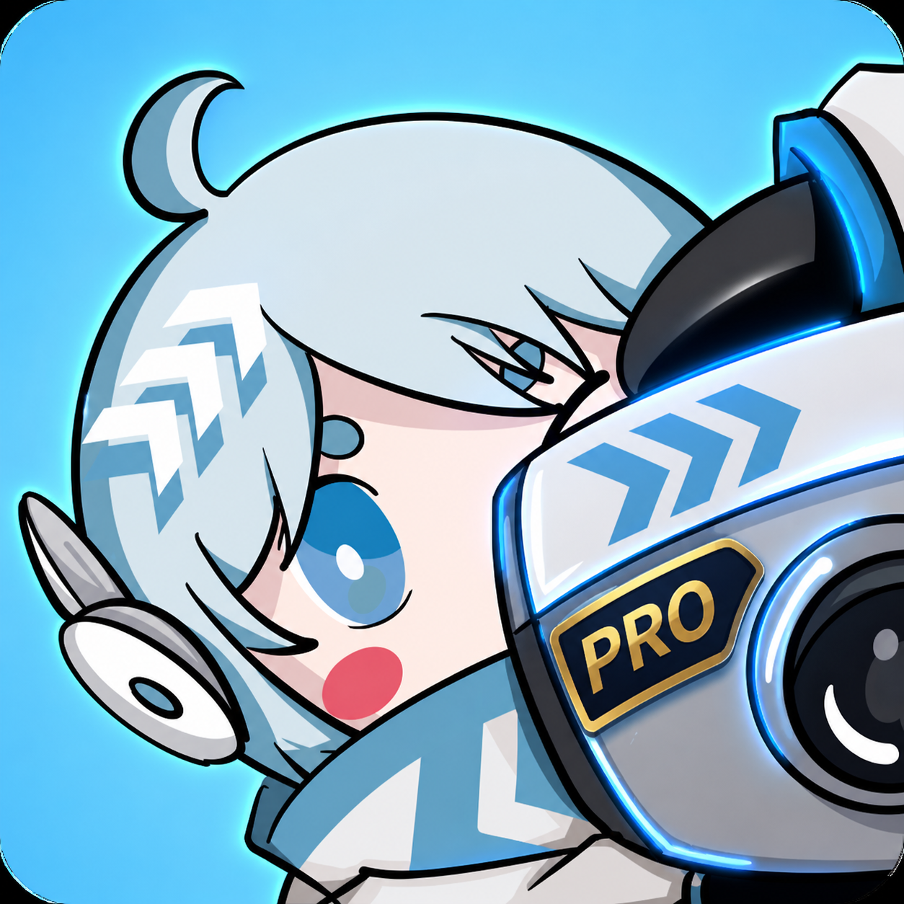
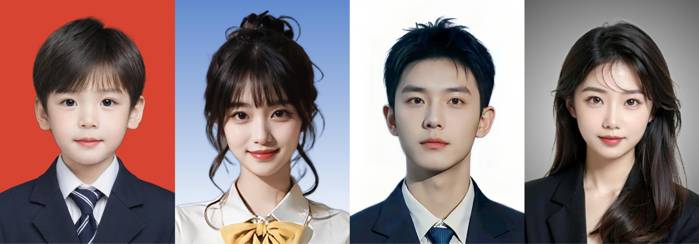
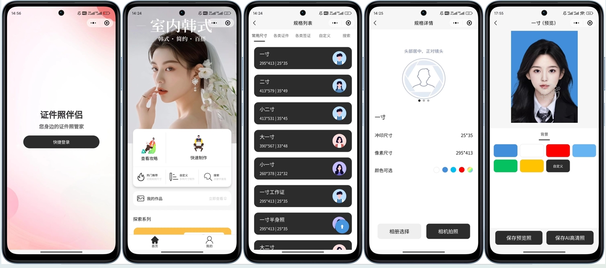
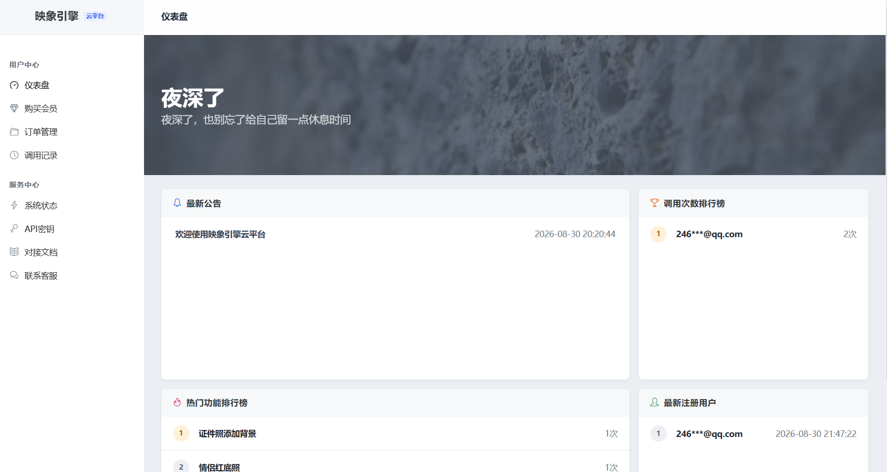
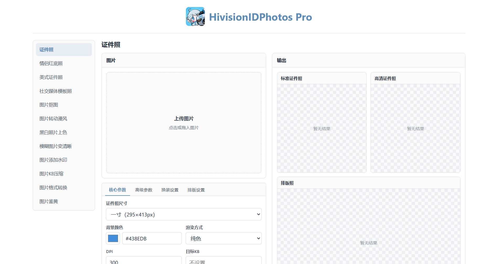
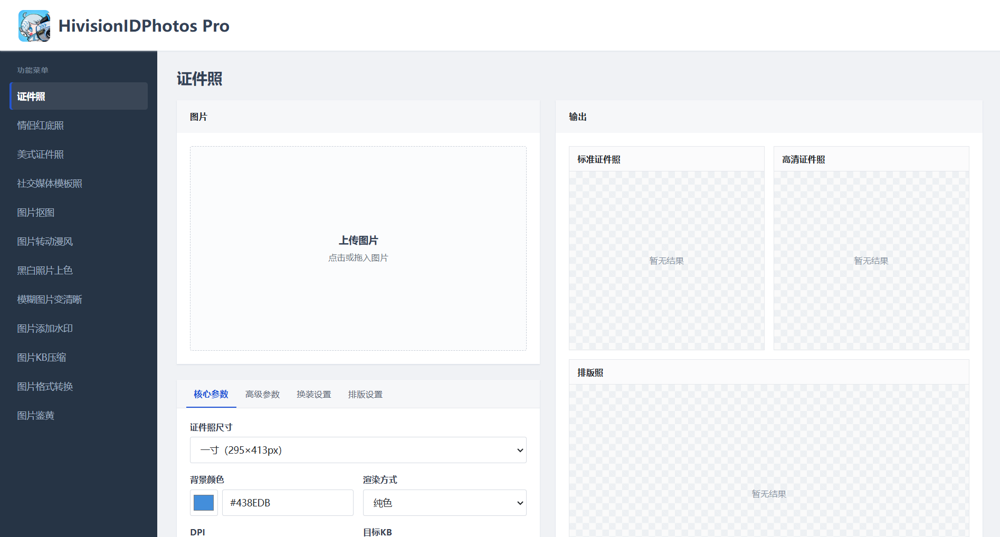
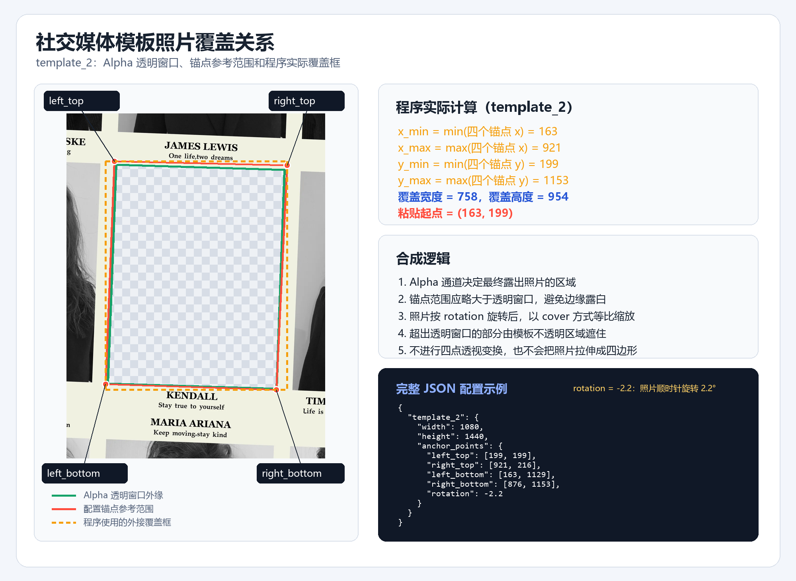

<p align="center"></p>

<h1 align="center">HivisionIDPhotos Pro</h1>

<p align="center"><strong>一个面向多场景的智能图像处理项目，集成丰富图片处理能力，拥有更强的功能，更快的速度</strong></p>

<p align="center"><a href="https://github.com/guaishoulab/HivisionIDPhotos-Pro/stargazers"></a>    <a href="./API.md"></a> <a href="https://github.com/Zeyi-Lin/HivisionIDPhotos"></a> <a href="./LICENSE"></a></p>

<p align="center">
  <a href="https://hivisionidphotospro.0po.cn/demo/index.html"></a>
  <a href="https://hivisionidphotospro.0po.cn/demo/index2.html"></a>
</p>

<p align="center"></p>


# 最近更新

- **2026.09.01：HivisionIDPhotos Pro 正式发布**


# 项目简介

**HivisionIDPhotos Pro** 基于 [HivisionIDPhotos](https://github.com/Zeyi-Lin/HivisionIDPhotos) 进行深度二次开发，整合更多图片处理能力；其内部架构、模型加载策略更专注专业级图片处理服务，而非针对小型轻量级设计

在保留原项目功能的基础上，进一步扩展了更多图片处理能力，具体功能见下方「主要功能」，各项功能采用模块化设计并提供独立接口，既能按需调用，也能自由组合成完整的图片处理流程，可轻松接入您的网站、小程序、APP、管理系统及第三方业务


# 主要功能

- 图片鉴黄
- 生成证件照
- 证件照添加背景
- 证件照换装
- 证件照排版
- 生成模板照
- 生成美式证件照
- 生成情侣红底照
- 人像抠图
- 万物抠图
- 图片添加水印
- 图片KB压缩
- 图片转换格式
- 图片转动漫风
- 黑白照片上色
- 模糊图片变清晰


## 相对原版改动

### 新增

- 新增 NSFWJS MobileNetV2 图片鉴黄，返回 `drawings`、`hentai`、`neutral`、`porn`、`sexy` 五项分数
- 新增 PP-MattingV2 人像分割模型
- 新增 YuNet 人脸检测模型
- 新增 Silueta 抠图模型
- 新增 DCT-Net 动漫风照片生成功能
- 新增 DDColor 黑白照片上色功能
- 新增 Real-ESRGAN 模糊图片变清晰功能
- 新增情侣红底照，支持双人人脸数量检查、七种纯色背景和酒红渐变背景
- 新增 JPG、JPEG、PNG 和静态 GIF 格式转换接口
- 新增证件照换装接口，支持男装、女装和儿童装
- 为美式证件照增加独立接口
- 为社交媒体模板照增加独立接口
- 新增统一业务错误响应，失败后返回具体的原因

### 删除

- 删除 Gradio 页面、命令行推理、Docker 部署、桌面打包、演示文件、测试文件
- 删除 Base64 图片传输，只保留处理速度最快的 multipart 图片方式传输
- 删除 Face++ 联网的人脸检测，只保留本地人脸检测
- 删除 `/idphoto_crop` 独立裁剪接口，证件照制作统一使用 `/idphoto`
- 删除全局跨域配置以及 Swagger、ReDoc入口

### 改造

- `/idphoto` 根据 `hd` 参数直接返回标准照或高清照，减少处理时间，不再一次返回两张 Base64 图片
- 美式证件照和模板照在内部完成制作与最终合成，接口只需要传入一次原图即可
- `/set_kb` 和各图片接口的指定 KB 功能改为只接收 multipart 图片并直接返回 JPEG 二进制
- 每次请求创建独立的 `IDCreator`，避免并发请求时出现的共享图片处理状态问题
- 除birefnet模型外，其余模型首次使用时会常驻内存，避免后续请求时重复加载模型从而导致处理速度太慢的问题；birefnet模型因为太占内存所以每次使用后会进行释放内存
- 图片处理接口使用同步函数，由 FastAPI 和 AnyIO 在线程池执行 CPU 密集型任务
- 统一业务错误响应，如：参数错误、人脸数量异常、模型错误等，错误时会统一返回明确原因
- 整理清晰目录，模型按名称分别存放在 `creator/models/`里面

### 修复

- 修复社交媒体模板在 `rotation >= 0` 时会计算出负宽高的问题，统一根据四个锚点的最小、最大坐标计算照片覆盖范围和粘贴起点
- 修复ONNX 使用 CUDA 加载失败时，因设备类型判断错误而无法回退到 CPU 的问题
- 修复在抠图结果没有有效轮廓时访问空轮廓并报错的问题，改为明确返回未识别到有效人像
- 修复 RetinaFace 模型缓存释放条件写反的问题，当前会在首次加载后复用
- 修复水印透明度重复参与合成，导致实际水印比设置值更浅的问题
- 修复模型文件缺失后仍继续处理并产生二次异常的问题，改为直接返回错误信息


# 接口文档

接口地址、请求参数、返回格式和错误协议统一在 [API.md](./API.md)


# 社区

一些由社区构建的 HivisionIDPhotos Pro 的有趣应用和扩展

| [HivisionIDPhotos-wechat-weappV2](https://github.com/no1yu/HivisionIDPhotos-wechat-weappV2) | [映象引擎云平台](https://cloud.0po.cn/) |
| :---: | :---: |
| [](https://github.com/no1yu/HivisionIDPhotos-wechat-weappV2) |  |
| 证件照微信小程序（Java 后端 + 原生微信小程序） | 提供全部模型能力的接口平台 |


# 运行环境

- Python：3.10.4

  

## 1.下载模型

如果要部署**全部模型**，那么你的服务器至少要 8 核 8 GB（如果不想部署可以使用映象引擎：https://cloud.0po.cn/），所以**只需要下载你需要使用的模型**即可，把下载的模型文件放入指定文件夹即可，模型下载地址和指定文件夹说明见下方的**模型说明**

## 2.安装依赖

```bash
python3 -m pip install -r requirements.txt
```

## 3.启动命令

```bash
python3 -m uvicorn app:app --host 0.0.0.0 --port 8081 --workers 1 --limit-concurrency 9999 --backlog 1024
```

注意：不要直接使用 `python3 app.py` 这个命令启动，因为这种方式不会应用 Uvicorn 的并发连接和等待队列参数

## 4.查看预览

服务启动后，可以通过浏览器访问下面两个地址，查看并体验两种不同风格的功能预览页面：

- `http://你的IP:8081/demo/index.html`
- `http://你的IP:8081/demo/index2.html`

如果不需要预览，或者不希望其它人访问，直接删除 `demo` 文件夹即可

<p align="center"></p>


## 宝塔部署

视频教程：http://xxx


# 模型说明

模型都可以在 CPU 上运行，用什么模型下什么模型即可，下载后放入 `creator/models/<指定文件夹>/`里面

| 模型名字 | 用途 | 存放目录 | 模型下载 |
| --- | --- | --- | :---: |
| [NSFWJS MobileNetV2](https://github.com/infinitered/nsfwjs) | 图片鉴黄 | `nsfwjs` | [下载](https://share.weiyun.com/yiPd5sUH) |
| [PP-MattingV2 STDC1 Human](https://github.com/PaddlePaddle/PaddleSeg/tree/release/2.10/Matting/configs/ppmattingv2) | 人像抠图 | `ppMattingV2` | [下载](https://share.weiyun.com/JWqtjeky) |
| [hivision_modnet](https://github.com/Zeyi-Lin/HivisionIDPhotos) | 人像抠图 | `hivisionModnet` | [下载](https://share.weiyun.com/dMDex1z8) |
| [MODNet](https://github.com/ZHKKKe/MODNet) | 精细人像抠图 | `modnetPhotographic` | [下载](https://share.weiyun.com/pnZL6kvz) |
| [RMBG-1.4](https://huggingface.co/briaai/RMBG-1.4) | 通用人像抠图 | `rmbg` | [下载](https://share.weiyun.com/48p4xCDO) |
| [YuNet](https://github.com/opencv/opencv_zoo/tree/main/models/face_detection_yunet) | 轻量人脸检测 | `yunet` | [下载](https://share.weiyun.com/A7J6YbGl) |
| [Selfie Multiclass](https://developers.google.com/edge/mediapipe/solutions/vision/image_segmenter) | 换装人体解析 | `selfieMulticlass` | [下载](https://share.weiyun.com/Dc4u3ahd) |
| [MTCNN](https://pypi.org/project/mtcnn-runtime/) | 人脸检测 | 无需操作 | 无需下载 |
| [RetinaFace ResNet50](https://github.com/biubug6/Pytorch_Retinaface) | 人脸检测 | `retinaface` | [下载](https://share.weiyun.com/vjMby4QH) |
| [Silueta](https://github.com/danielgatis/rembg) | 轻量精细抠图 | `silueta` | [下载](https://share.weiyun.com/pW2CkR3Y) |
| [DCT-Net](https://github.com/menyifang/DCT-Net) | 动漫风照片 | `cartoon` | [下载](https://share.weiyun.com/JBilgV19) |
| [DDColor ModelScope](https://github.com/piddnad/DDColor) | 黑白照片上色 | `ddcolor` | [下载](https://share.weiyun.com/Hacupzmc) |
| [Real-ESRGAN General x4v3](https://github.com/xinntao/Real-ESRGAN) | 模糊图片变清晰 | `realEsrgan` | [下载](https://share.weiyun.com/x8T2Sw5L) |
| [BiRefNet v1 Lite](https://github.com/ZhengPeng7/BiRefNet) | 高精度人像抠图 | `birefnet` | [下载](https://share.weiyun.com/vyRhf4Fq) |

补充来源：

1. 基于 [MODNet](https://github.com/ZHKKKe/MODNet)
2. `RMBG-1.4` 算法基于 
3. `Selfie Multiclass` 的 ONNX 转换来源为 
4. `Silueta` 模型基于 
5. `Real-ESRGAN General x4v3` 的 ONNX 导出来源为 
6. 除 BiRefNet 外，其它模型首次请求时会加载到内存并常驻，用于加快后续处理速度；BiRefNet 因占用内存较大，每次执行完成后会进行释放内存


# 如何修改水印字体？

当前水印字体文件是 `tools/font/SourceHanSansSC-Regular.otf`，字体由 `tools/watermark.py` 读取


更换字体时按以下步骤操作：

1. 将新的 `.ttf` 或 `.otf` 字体文件放入 `tools/font/`，例如新的字体文件是： `MyWatermarkFont.ttf`
2. 打开 `tools/watermark.py`，修改文件开头用于**服务启动时校验字体**的 `ImageFont.truetype(...)`。将其中的 `SourceHanSansSC-Regular.otf` 改为 `MyWatermarkFont.ttf`：

```python
ImageFont.truetype(
    os.path.join(os.path.dirname(__file__), "font", "MyWatermarkFont.ttf"),
    size=10,
).getname()
```

3. 继续在同一个文件的 `add_watermark(...)` 函数中，修改用于**生成水印时实际加载字体**的 `ImageFont.truetype(...)`：

```python
font = ImageFont.truetype(
    os.path.join(os.path.dirname(__file__), "font", "MyWatermarkFont.ttf"),
    size=watermark_size,
)
```

4. 两处文件名必须完全一致，否则服务可能启动失败，或调用 `/watermark` 时加载不到字体
5. 重启服务后生效，再调用 `/watermark` 检查中文、英文和数字是否能正常显示


# 如何添加社交媒体模板照？

模板功能由 `tools/template/template_calculator.py` 读取模板 PNG 和 `tools/template/assets/template_config.json` 后完成合成


新增模板时按以下步骤操作：

1. 制作一张带 Alpha 透明通道的四通道 PNG 模板图。需要放置照片的区域必须透明，其余装饰内容保持可见
2. 将模板放入 `tools/template/assets/`。文件名就是接口使用的 `template_name`，例如新的文件名是： `template_3.png` 就需要对应 `template_name=template_3`
3. 确认模板 PNG 的实际像素宽高，例如宽 `1080`、高 `1440`。该尺寸必须和下一步 JSON 中的 `width`、`height` 完全一致
4. 打开 `tools/template/assets/template_config.json`，增加与文件名相同的配置：

```json
{
    "template_3": {
        "width": 1080,
        "height": 1440,
        "anchor_points": {
            "left_top": [199, 199],
            "right_top": [921, 216],
            "left_bottom": [163, 1129],
            "right_bottom": [876, 1153],
            "rotation": -2.2
        }
    }
}
```

5. 四个锚点都使用模板左上角作为坐标原点，单位为像素：
   - `left_top`：照片覆盖参考范围的左上角
   - `right_top`：照片覆盖参考范围的右上角
   - `left_bottom`：照片覆盖参考范围的左下角
   - `right_bottom`：照片覆盖参考范围的右下角
   - `rotation`：照片覆盖方向相对竖直方向的角度，正数表示逆时针，负数表示顺时针

锚点围成的是照片覆盖透明窗口时的参考范围，不是 PNG 透明区域的精确边界

参考范围应略大于实际透明窗口，防止合成后边缘露白

程序会根据四个锚点的最小、最大坐标得到覆盖宽高和粘贴起点，再将照片旋转、等比缩放并覆盖到模板下方，不进行四点透视变换

6. 打开 `app.py`，找到 `/generate_template_photos` 接口中的模板校验：

```python
if template_name not in ["template_1", "template_2"]:
    raise HTTPException(status_code=404, detail="模板名称无效")
```

将新模板加入允许列表：

```python
if template_name not in ["template_1", "template_2", "template_3"]:
    raise HTTPException(status_code=404, detail="模板名称无效")
```

7. 重启服务后生效，直接调用 `/generate_template_photos` 并传入 `template_name=template_3`。检查人物是否完整覆盖透明区域，以及四周是否露白、越界或旋转方向错误；如有偏差，只调整 `template_config.json` 的四个锚点和 `rotation`




# 许可证

**HivisionIDPhotos Pro** 是基于 [HivisionIDPhotos](https://github.com/Zeyi-Lin/HivisionIDPhotos) 进行深度二次开发的，非 HivisionIDPhotos 官方发布的版本

本项目与原项目一样，遵循 [Apache License 2.0](https://chatgpt.com/c/LICENSE) 开源许可协议

特别感谢 HivisionIDPhotos 项目及作者的开源贡献
